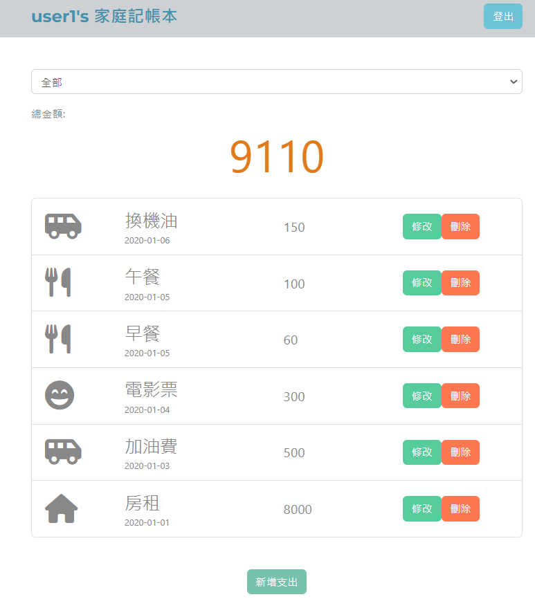

# expense-tracker

## 專案呈現畫面



## 功能描述 (features)

- 使用者註冊: 使用者可透過輸入姓名、Email、密碼、確認密碼進行註冊，所有欗位皆為必填，輸入有錯誤時
  畫面會跳出錯誤提示
- 使用者登入:
  - 使用者可透過 Email、密碼登入才可看見自己的記帳清單
  - 使用者可透過 Facebook 帳號進行登入
  - 輸入有錯誤時畫面會跳出提示
- 登入後:
  - 首頁可一次瀏覽所有支出的清單
  - 首頁可看到所有支出清單的總金額
  - 顯示輸入該筆支出的時間
  - 可針對不同支出類別篩選跟呈現該類別的支出項目以及計算出該類別總和
  - 可新增支出資料
  - 可修改支出資料
  - 可刪除支出資料
  - 按刪除鍵會有彈窗提醒

## 安裝與執行步驟 (installation and execution)

- 下載專案到本地端

  ```
  git clone https://github.com/Ellen-ho/expense-tracker.git
  ```

- 打開終端機進入到下載的資料夾

  ```
  cd expense-tracker
  ```

- 執行指令安裝所需套件

  ```
  npm install
  ```

- 參考 .env.example 的內容，建立 .env 檔，並填入需要的變數

- 新增種子資料

  ```
  npm run seed
  ```

- 安裝完成後，執行 nodemon 啟動專案

  ```
  npm run dev
  ```

  或想直接使用 node 指定啟動專案，可以執行以下指令

  ```
  npm start
  ```

- 看到終端機顯示 "Express is listening on localhost:3000"，即可開啟瀏覽器在網址列輸入 localhost:3000 進入網站

## 環境建置與需求 (prerequisites)

- Node.js: v10.15.0
- express: v4.17.1
- express-handlebars: v5.2.0
- method-override: v3.0.0
- mongoose: 5.10.9
- mongoDB: 4.2.10
- bootstrap: v4.2.1
- font-awesome: v5.8.1
- jQuery: v3.3.1
